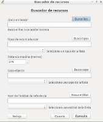
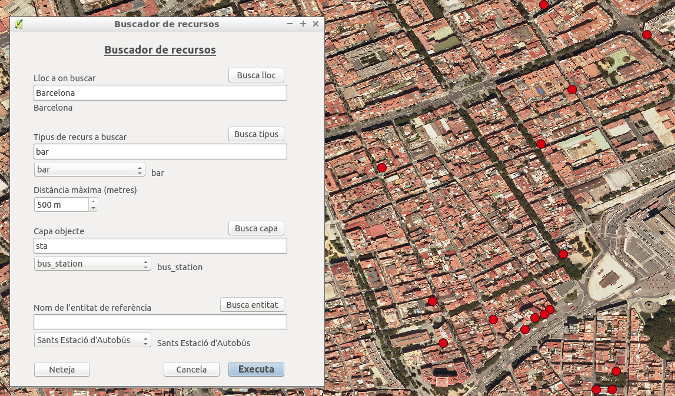

# BuscaRecursos #

The BuscaRecursos plugin generates a points vector layer for a certain type of
OpenStreetMap amenity available in a city, wich it finds inside a particular
area. This area is delimited by the location of a amenity's facility and a
maximum distance.

The following dialog box is displayed when "BuscaRecursos" is launched.

You have to put:
 - City Name
 - Amenity's value name that you want to generate the layer
 - Maximum distance
 - Amenity's value name of facility
 - Facility name

Read more in: [https://github.com/magipamies/qgis_BuscaRecursos_pluguin](https://github.com/magipamies/qgis_BuscaRecursos_pluguin)

## Installation

The plugin can be installed using the QGIS Plugin Manager, go into Qgis to `Plugins` menu and `Manage and install plugins`, in `All` section search for `BuscaRecursos`.

The plugin will be available in the `Plugins` menu and `Plugins toolbar`.

### Manual

The plugin files need to live in a directory called `BuscaRecursos` inside the QGIS Python plugins directory.

*Windows note:* The QGIS plugin directory should be under `C:\Documents and Settings\<Username>\.qgis2\python\plugins\` (Windows XP) or `C:\Users\<Username>\.qgis2\python\plugins\` (Windows +7).

*QGIS 1.8 note:* QGIS 1.8 stores it config under a `.qgis` directory.

Once the plugin is loaded in the python directory, it can be enabled from the list of installed plugins in QGIS and then accessed from the plugins menu.

### Using git

If you are using `git` then simply clone the repository into your QGIS python plugins directory:

    cd ~/.qgis2/python/plugins/
    git clone https://github.com/magipamies/qgis_BuscaRecursos_pluguin.git BuscaRecursos

## Source code

Read more in: [https://github.com/magipamies/qgis_BuscaRecursos_pluguin](https://github.com/magipamies/qgis_BuscaRecursos_pluguin)

## Issue Tracker

Issues, ideas and enhancements: [https://github.com/magipamies/qgis_BuscaRecursos_pluguin/issues](https://github.com/magipamies/qgis_BuscaRecursos_pluguin/issues)

### Contact

Magí Pàmies Sans: *magipamies@gmail.com*  

## License

BuscaRecursos is a free/libre software and is licensed under the GNU General Public License.
