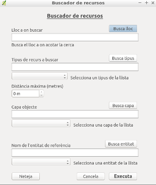

# BuscaRecursos #

BuscaRecursos és un plugin de Qgis que permet obtenir una capa vectorial amb els recursos de la categoria seleccionada, que es troben dins de la distància determinada d'una entitat de referència.

## Instal·lació
